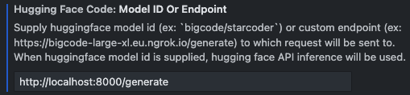

# `llm-vscode` Inference Server

This repository serves as an alternative endpoint server for the [llm-vscode](https://github.com/huggingface/llm-vscode) extension (*formerly known as the Hugging Face VSCode extension*). In contrast to [LucienShui/huggingface-vscode-endpoint-server](https://github.com/LucienShui/huggingface-vscode-endpoint-server), the main objective here is to integrate support for **quantized** open-source LLMs tailored for coding tasks into the `llm-vscode` extension. Such an integration would make self-hosting a code completion service not only more accessible but also more cost-effective and faster, even on smaller GPUs and CPUs.


Tested with :

- [TheBloke/CodeLlama-7B-Python-AWQ](https://huggingface.co/TheBloke/CodeLlama-7B-Python-AWQ)

I will test more models later.

## Usage
### Install requirements
```shell
pip install -r requirements.txt
```
### Serving
```
python api_server.py --trust-remote-code --model [/path/to/model/folder]
```

By default, the server runs on `localhost` using port `8000`. You can also specify a different port by using the `--port` flag.

Since the `api_server.py` in this repository is adapted from [`api_server.py`](https://github.com/vllm-project/vllm/blob/main/vllm/entrypoints/api_server.py), it inherits the same arguments. You can refer to [`arg_utils.py`](https://github.com/vllm-project/vllm/blob/main/vllm/engine/arg_utils.py) to review all the supported command line arguments.

For quantized models, you should append the following arguments: `--quantization awq --dtype half`. For example:

```shell
python api_server.py --trust-remote-code --model [/path/to/model/folder] --quantization awq --dtype half
```
### Config in VSCode
1. Open VSCode, go to `Preferences` -> `Settings`, navigate to `Hugging Face Code` section.

2. Set `Config Template` to `Custom`:

    
    
3. Set `Model ID or Endpoint` to `http://localhost:8000/generate`, and replace the port number if you are using a different one:

    

## API

- Request:

    ```shell
    curl http://localhost:8000/generate -d '{"inputs": "def quick_sort", "parameters": {"max_new_tokens": 64}}'
    ```
- Response:
    ```json
    {
        "generated_text": "def quick_sort(numbers):\n    if len(numbers) < 2:\n        return numbers\n    else:\n        pivot = numbers[-1]\n        less = [\n            el\n            for ind, el in enumerate(numbers[:-1])\n            if el <= pivot and ind != -1\n",
        "status": 200
    }
    ```

## TODO

- [ ] Test more models
- [ ] Test distributed serving

## References

- [huggingface/llm-vscode
](https://github.com/huggingface/llm-vscode)
- [vllm-project/vllm](https://github.com/vllm-project/vllm)
- [LucienShui/huggingface-vscode-endpoint-server](https://github.com/LucienShui/huggingface-vscode-endpoint-server)